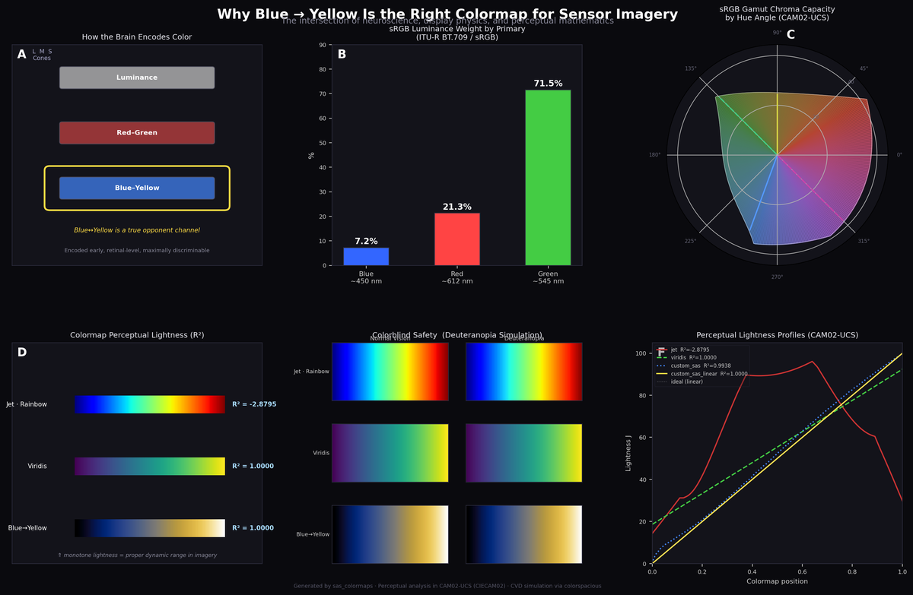
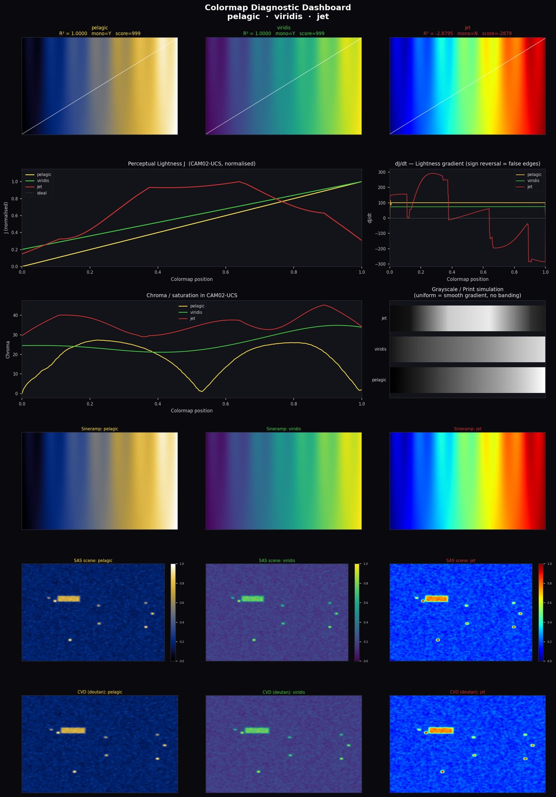
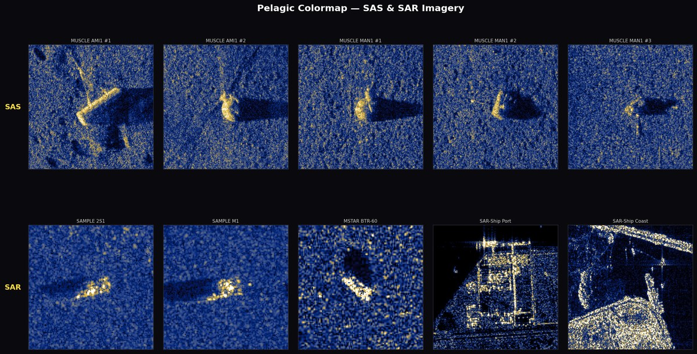
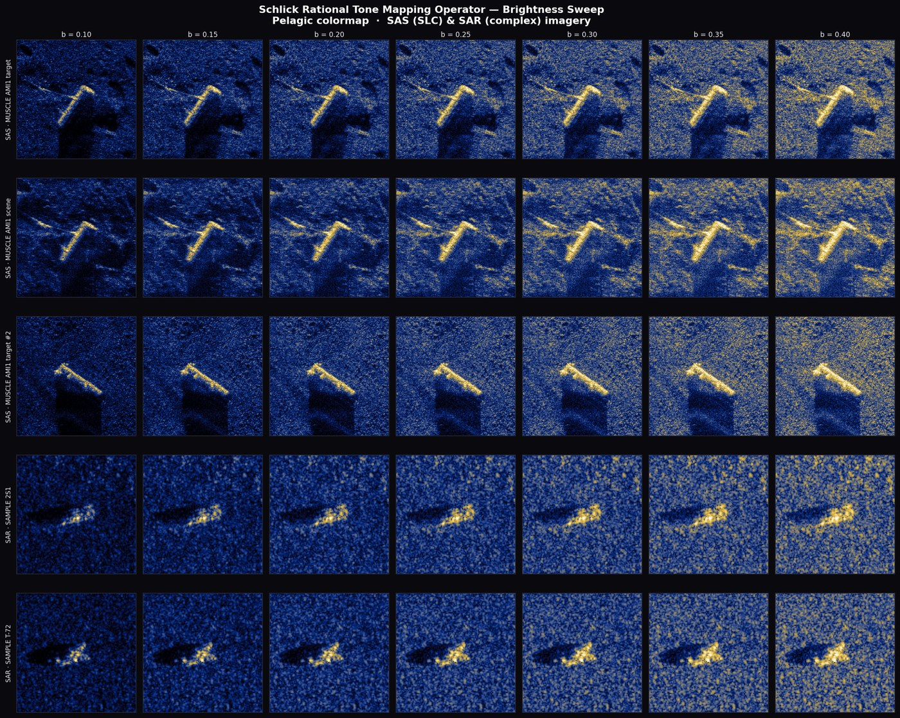

# Pelagic


A perceptually linear blue-to-yellow colormap and Schlick rational tone mapping operator for SAS/SAR intensity imagery.

## Pelagic Colormap

Perceptually uniform colormap designed for sonar and radar imagery:

- **Perceptual lightness** (J in CAM02-UCS) is exactly linear (R² = 1.0000)
- **Colorblind-safe** — rides the blue-yellow opponent axis, unaffected by red-green CVD (~8% of males)
- **Monotonically increasing luminance** — no false edges or banding artifacts
- **256 entries, baked** — no runtime dependency on colorspacious
- Only requires `numpy` and `matplotlib`

### Usage

```python
from pelagic import pelagic
import matplotlib.pyplot as plt

plt.imshow(data, cmap=pelagic)

# Or register with matplotlib for string access:
from pelagic import register
register()
plt.imshow(data, cmap="pelagic")
```

### Why Blue-to-Yellow?



**Panel A** — Blue-yellow is a true neural opponent channel, encoded at the retinal level.
**Panel B** — Blue carries only 7.2% of sRGB luminance, leaving the full luminance axis available for intensity encoding.
**Panel C** — Gamut chroma capacity by hue angle shows the blue-yellow axis provides good saturation.
**Panel D** — Perceptual lightness R² comparison: jet (0.28), viridis (1.00), Pelagic (1.00).
**Panel E** — Under deuteranopia simulation, Pelagic is preserved while jet becomes unreadable.
**Panel F** — Lightness profiles confirm Pelagic tracks the ideal linear diagonal.

### Diagnostic Dashboard



Side-by-side comparison of `pelagic`, `viridis`, and `jet` across: sineramp tests, perceptual lightness J, dJ/dt gradient, chroma profiles, grayscale simulation, synthetic SAS scenes, and CVD simulation.

### SAS & SAR Imagery



Top row: MUSCLE SAS mine-hunting imagery. Bottom row: SAMPLE, MSTAR, and SAR-Ship datasets.

---

## Schlick Rational Tone Mapping Operator

Dynamic range compression for high-dynamic-range sonar/radar imagery, implementing the rational tone mapping operator from:

> Schlick, C. (1998). "Quantization Techniques for Visualization of High Dynamic Range Pictures." *Photorealistic Rendering Techniques*, Springer. DOI: [10.1007/978-3-642-87825-1_2](https://doi.org/10.1007/978-3-642-87825-1_2)

The operator maps normalised intensity via:

```
L_out = (b * L) / ((b - 1) * L + 1)
```

where `b` is derived from image statistics and a user-specified brightness target.

### Usage

```python
from schlick_drc import schlick
import numpy as np

# For complex SAS/SAR data:
magnitude = np.abs(complex_image)
compressed = schlick(magnitude, brightness=0.3)

# With a mask (e.g. to ignore zero-padded regions):
compressed = schlick(magnitude, brightness=0.25, mask=valid_pixels)
```

### Brightness Sweep



Schlick rational tone mapping applied to SAS (SLC) and SAR (complex) imagery. Brightness parameter swept from 0.10 (dark, high contrast) to 0.40 (lifted background). The 0.25-0.30 range is typically optimal for operational display.

---

## See Also

- [NOAA Monitor National Marine Sanctuary — Technology for Conservation](https://monitor.noaa.gov/science/technology-for-conservation/) — High-resolution synthetic aperture sonar (SAS) imagery of the USS Monitor shipwreck, captured using Northrop Grumman's uSAS system.

## Installation

No package installation needed. Copy `pelagic.py` and/or `schlick_drc.py` into your project.

**Dependencies:**
- `pelagic.py` — `numpy`, `matplotlib`
- `schlick_drc.py` — `numpy`

## License

MIT
